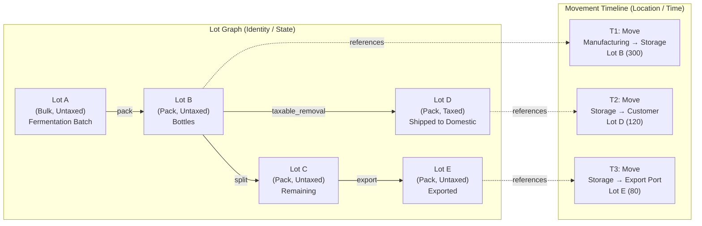

```mermaid
  %% =====================
  %% LOT GRAPH (IDENTITY)
  %% =====================
  flowchart LR
  subgraph LG["Lot Graph (Identity / State)"]
    direction TB

    L0["Lot A\n(Bulk, Untaxed)\nFermentation Batch"]
    L1["Lot B\n(Pack, Untaxed)\nBottles"]
    L2["Lot C\n(Pack, Untaxed)\nRemaining"]
    L3["Lot D\n(Pack, Taxed)\nShipped to Domestic"]
    L4["Lot E\n(Pack, Untaxed)\nExported"]

    L0 -->|pack| L1
    L1 -->|split| L2
    L1 -->|taxable_removal| L3
    L2 -->|export| L4
  end

  %% ==========================
  %% MOVEMENT TIMELINE (WHERE)
  %% ==========================
  subgraph MT["Movement Timeline (Location / Time)"]
    direction TB

    M1["T1: Move\nManufacturing → Storage\nLot B (300)"]
    M2["T2: Move\nStorage → Customer\nLot D (120)"]
    M3["T3: Move\nStorage → Export Port\nLot E (80)"]
  end

  %% ==========================
  %% INTERSECTION (REFERENCE)
  %% ==========================
  L1 -. references .-> M1
  L3 -. references .-> M2
  L4 -. references .-> M3
```